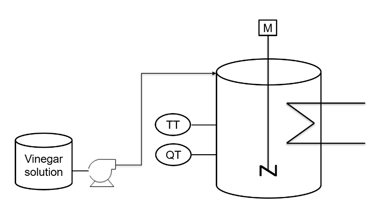

# Automation of a batch reaction with a Raspberry Pi.

In the reactor should be a certain pH-value and a specified temperature. The thresholds for both values have to be put in by the operator. To achieve the specified temperature a heater will be used. For the pH-value will be a vinegar solution used. This will be given into the system from a different vessel with a small pump. To have a better understanding of the concept the following process diagram is introduced.

Please read the report for more information. 

